<div align="center">



`fogg@github:~$ whoami`

</div>


## `01 // sobre`

Salve, eu sou o **Pedro Foggiato**. Vim do desenvolvimento Full Stack e agora estou migrando pra DevSecOps.

Estou montando essa base aos poucos: Linux, redes, cloud, IAM, AWS, segurança defensiva, entender como um ataque funciona na prática. Já tenho experiência construindo produto, fundei a Uzzo Solutions, então já venho com alguma bagagem, só troquei de foco.

Documento aqui os labs, scripts e testes que vou fazendo, mais por costume do que por plano. Erro bastante ainda, e tá tudo bem.

```bash
$ cat focus.txt

linux
networking
identity_and_access_management
cloud
defensive_security
automation
ai_integrations
```

Ultimamente tenho focado mais em IAM e Cloud Security, mas nada disso segura sem uma base decente de sistemas e rede.


## `02 // como_aprendo`

Teoria sozinha não fica muito comigo, preciso testar as coisas pra entender de verdade.

```text
entender → testar → quebrar → descobrir o porquê → refazer certo → documentar
```

Meus projetos ficam nessa zona entre segurança, Linux, automação, API, IA e infraestrutura. Gosto mais de fazer peça conversar com peça do que montar mais uma demo isolada rodando só na minha máquina.

Um deles é o **Jarvis Bridge**: comecei tentando montar um assistente de voz local e fui mexendo com automação, integração de IA, comportamento de sistema, um tanto de jeito diferente de dar errado no caminho. Longe de ser um JARVIS de verdade, mas rendeu bastante aprendizado.

Tá tudo nos repositórios, se quiser ver melhor como funciona.


## `03 // stack_em_progresso`

<div align="center">


</div>


## `04 // fora_do_terminal`

Fora da tela: estética digital, identidade visual, música, Marvel, anime e qualquer ideia boba que acaba virando projeto.

Isso vaza um pouco pros projetos técnicos também, geralmente acabo caprichando na aparência deles.


<div align="center">


</div>
